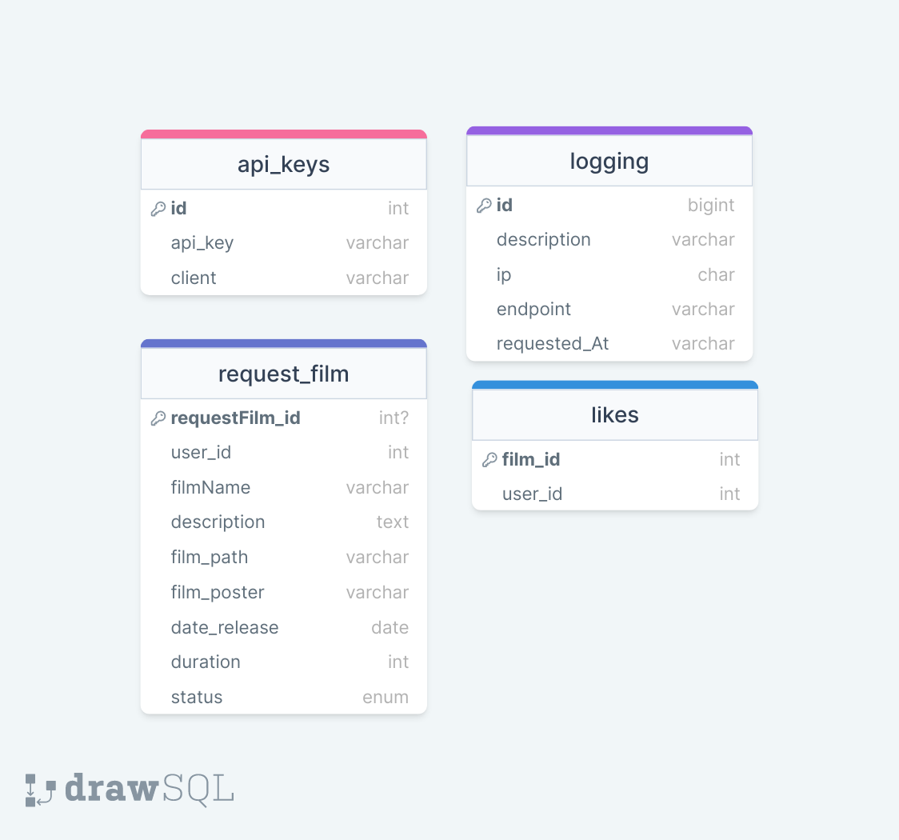

# SOAP Service for Notflix App
This is a SOAP Service for Notflix which manages users subscription and likes in Notflix app, manage users film request in Notflix premium app

## Database Schemes

## Endpoint API

## Prerequisites
1. Make sure your machine has Docker and Docker Compose installed.
2. Make sure your machine has NodeJS installed.


## How To Run
1. Make an .env file based of .env.example
2. Navigate to the root directory of the project.
3. Run the following command:

    ```
    docker-compose up -d
    ```
4. Or you can run it locally
    
        ```
        mvn clean install
        ```

This will start the Notflix REST Service application using Docker containers.


## Task Division
| Feature             | NIM          |
|---------------------|--------------|
| **Database**           | 13521165     |
| **Subscription Service**    | 13521165     |
| **Request Film Service**    | 13521132     |
| **Like Film Service**    | 13521130     |
| **Email**    | 13521130     |
